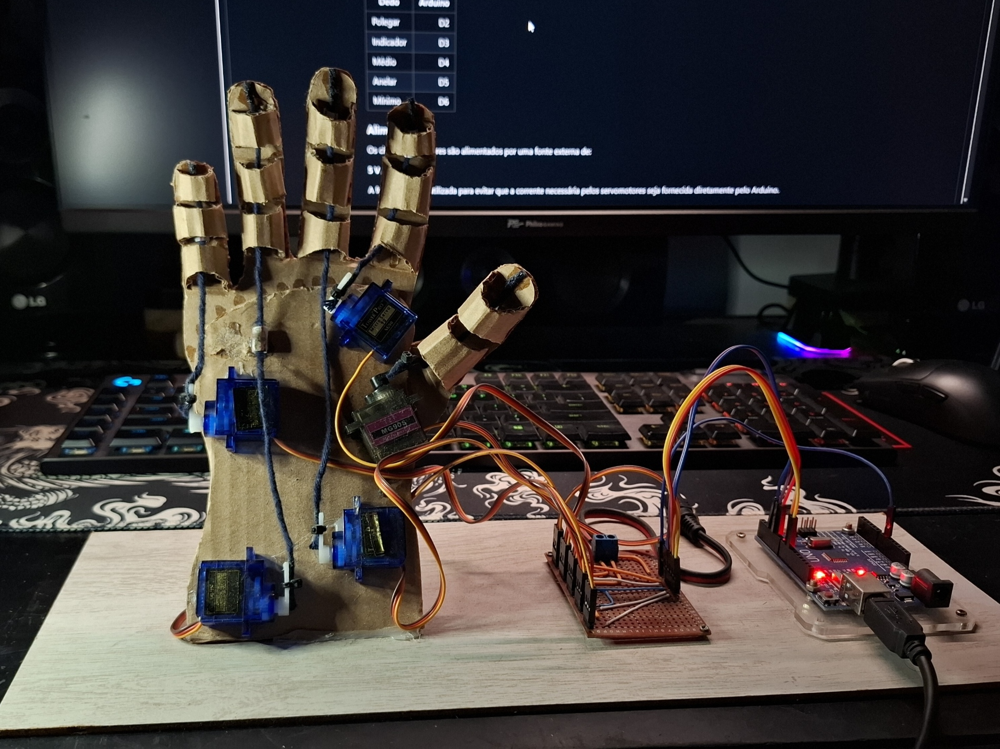
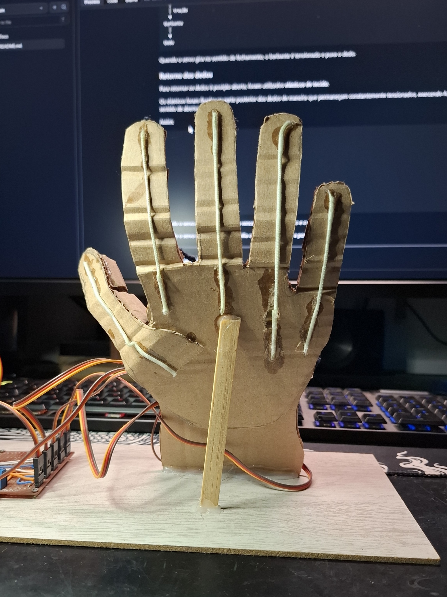
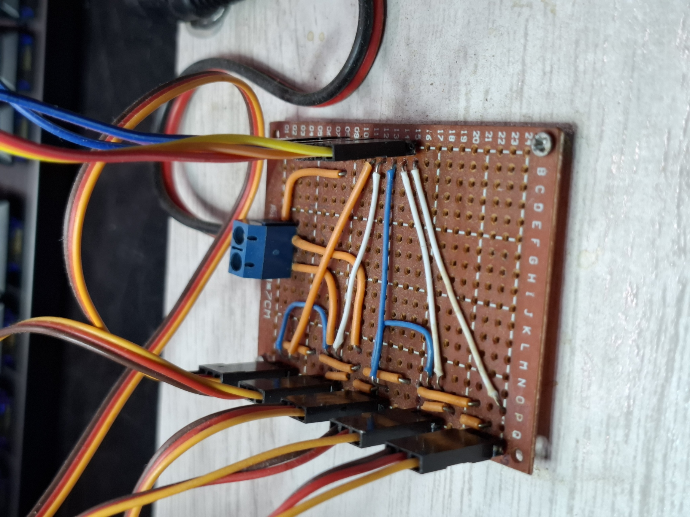

# 🤖 Mão Robótica Controlada por Visão Computacional

> Projeto educacional e experimental de uma mão robótica controlada por visão computacional, desenvolvido com componentes de baixo custo e materiais acessíveis, com o objetivo de permitir que estudantes possam reproduzir, estudar e aprimorar o projeto.

---

## 📖 Sobre o projeto

Este projeto consiste no desenvolvimento de uma **mão robótica capaz de reproduzir individualmente os movimentos dos cinco dedos de uma mão humana utilizando visão computacional**.

Uma câmera captura os movimentos realizados pelo usuário. O computador utiliza **Python, OpenCV e MediaPipe** para identificar a mão e determinar individualmente o estado de cada dedo.

As informações são convertidas em um comando de cinco posições e enviadas através de comunicação serial para um **Arduino Uno**.

O Arduino interpreta o comando e controla cinco servomotores, sendo **um servo dedicado a cada dedo**.

O movimento dos servos é transmitido para os dedos através de **barbantes utilizados como tendões artificiais**. Para retornar os dedos à posição aberta, são utilizados **elásticos de tecido**, que exercem uma força contrária à tração dos servomotores.

O resultado é um sistema no qual o movimento realizado pelo usuário é reproduzido pela mão robótica em tempo real.

---

# 🧠 Funcionamento

O funcionamento do projeto pode ser dividido em quatro etapas principais:

<div align="center">

<pre>
┌──────────────────┐
│      CÂMERA      │
└────────┬─────────┘
         │
         ▼
┌──────────────────────────┐
│      PYTHON + OPENCV     │
│        + MEDIAPIPE       │
└────────────┬─────────────┘
             │
             │ Estado dos 5 dedos
             ▼
┌──────────────────────────┐
│      COMANDO SERIAL      │
│        "10100"            │
└────────────┬─────────────┘
             │
             │ USB / Serial
             ▼
┌──────────────────────────┐
│       ARDUINO UNO        │
└────────────┬─────────────┘
             │
       ┌─────┴─────┐
       │           │
       ▼           ▼
  ┌─────────┐  ┌─────────┐
  │ SERVOS  │  │ SERVOS  │
  │  1 2 3  │  │  4  5   │
  └────┬────┘  └────┬────┘
       │             │
       ▼             ▼
   Tendões        Tendões
       │             │
       └──────┬──────┘
              ▼
       ┌─────────────┐
       │ MÃO ROBÓTICA│
       └─────────────┘
</pre>

</div>

---

# 👁️ Visão Computacional

A visão computacional é executada no computador utilizando:

* **Python**
* **OpenCV**
* **MediaPipe**
* **PySerial**

O MediaPipe Hands é responsável por identificar a mão e suas principais articulações.

O programa analisa a posição dos pontos detectados para determinar se cada dedo está levantado ou abaixado.

São analisados individualmente:

1. Polegar
2. Indicador
3. Médio
4. Anelar
5. Mínimo

A detecção funciona tanto para a **mão esquerda quanto para a mão direita**.

A lógica do polegar é ajustada de acordo com o lado identificado pelo MediaPipe, enquanto os demais dedos são analisados utilizando suas posições relativas no eixo vertical.

---

# 🎯 Área de controle

Para evitar que qualquer movimento detectado pela câmera seja imediatamente enviado para a mão robótica, o software possui uma **área de controle delimitada na imagem**.

```text
┌─────────────────────────────────────────┐
│                                         │
│                                         │
│                     ┌───────────────┐   │
│                     │               │   │
│                     │ ÁREA DE       │   │
│                     │ CONTROLE      │   │
│                     │               │   │
│                     └───────────────┘   │
│                                         │
└─────────────────────────────────────────┘
```
---

<p align="center">
  
</p>

---

O sistema verifica a posição do pulso.

Quando o pulso está dentro da área delimitada:

**Controle Ativo!**

Quando o pulso está fora:

**Pulso fora da área!**

Dessa maneira, o usuário pode posicionar a mão na área definida antes de começar a controlar a mão robótica.

---

# 🔢 Sistema de comandos

Cada dedo possui um bit no comando enviado ao Arduino.

A sequência utilizada é:

```text
Polegar → Indicador → Médio → Anelar → Mínimo
```

Cada posição pode assumir dois estados:

```text
0 = Aberto
1 = Fechado
```

Por exemplo:

```text
10100
```

significa:

```text
Polegar   → Fechado
Indicador → Aberto
Médio     → Fechado
Anelar    → Aberto
Mínimo    → Aberto
```

O comando é enviado continuamente enquanto uma mão válida estiver dentro da área de controle.

---

# ⚙️ Sistema mecânico

A estrutura da mão foi construída utilizando **papelão**, tornando o projeto simples e acessível para reprodução.

Cada dedo possui um sistema independente de movimentação.

---

<p align="center">
  
</p>

---


### Tendões

Para transmitir o movimento dos servomotores para os dedos, foram utilizados **barbantes**, funcionando como tendões artificiais.

```text
Servo
  │
  │ tração
  ▼
Barbante
  │
  ▼
Dedo
```

Quando o servo gira no sentido de fechamento, o barbante é tensionado e puxa o dedo.

### Retorno dos dedos

Para retornar os dedos à posição aberta, foram utilizados **elásticos de tecido**.

Os elásticos foram fixados na parte posterior dos dedos de maneira que permaneçam constantemente tensionados, exercendo força no sentido de abertura.

Assim:

```text
              FECHAMENTO
                  ↑
                  │
               Barbante
                  │
               ┌──┴──┐
               │ Dedo│
               └──┬──┘
                  │
                  ↓
              ELÁSTICO
              ABERTURA
```
---

<p align="center">
  
</p>

---


Quando o servo é acionado, sua força vence a tensão do elástico e o dedo é fechado.

Quando o servo retorna, o elástico auxilia o dedo a voltar para a posição aberta.

---

# 🔌 Eletrônica

O sistema utiliza um **Arduino Uno** para controlar os cinco servomotores.

Os sinais de controle são conectados aos pinos:

| Dedo      | Arduino |
| --------- | ------: |
| Polegar   |      D3 |
| Indicador |      D5 |
| Médio     |      D6 |
| Anelar    |      D9 |
| Mínimo    |      D10 |

### Alimentação

Os cinco servomotores são alimentados por uma fonte externa de:

**5 V / 2 A**

A fonte externa é utilizada para evitar que a corrente necessária pelos servomotores seja fornecida diretamente pelo Arduino.

O **GND da fonte dos servos é compartilhado com o GND do Arduino**, criando uma referência comum para os sinais de controle.

```text
             FONTE 5 V / 2 A
                  │
           ┌──────┴──────┐
           │             │
          +5V           GND
           │             │
           ▼             │
     ┌─────────────┐     │
     │  SERVOS     │     │
     │  1 2 3 4 5  │     │
     └──────┬──────┘     │
            │            │
       Sinais            │
      D3-D10              │
            │            │
            ▼            ▼
        ┌──────────────────┐
        │    ARDUINO UNO   │
        │                  │
        │ D3 → Servo 1     │
        │ D5 → Servo 2     │
        │ D6 → Servo 3     │
        │ D9 → Servo 4     │
        │ D10 → Servo 5     │
        │                  │
        │ GND ─────────────┘
        └──────────────────┘
```

---

<p align="center">
  
</p>


---
> ⚠️ **Importante:** os servomotores não devem ser alimentados diretamente pelos pinos de 5 V do Arduino. Uma fonte externa adequada deve ser utilizada, mantendo o GND comum entre a fonte e o Arduino.

---

# 🧩 Placa de conexão

**Opcionalmente,** pode ser desenvolvida uma pequena placa de distribuição utilizando placa perfurada para facilitar a montagem.

<p align="center">
  
</p>

A placa possui:

* Conectores para os cinco servomotores;
* Conexões para os sinais de controle;
* Distribuição da alimentação de 5 V;
* Conexão por borne para a fonte externa;
* GND comum para os servomotores.

A finalidade da placa não é realizar processamento eletrônico, mas **organizar e facilitar as conexões do sistema**.

---

# 🛠️ Componentes

| Componente         | Quantidade | Função                               |
| ------------------ | ---------: | ------------------------------------ |
| Arduino Uno        |          1 | Controle dos servomotores            |
| Servomotor DG90    |          5 | Acionamento dos dedos                |
| Fonte 5 V / 2 A    |          1 | Alimentação dos servos               |
| Placa perfurada    |          1 | Distribuição das conexões            |
| Conectores         |          5 | Conexão dos servos                   |
| Borne              |          1 | Entrada da alimentação externa       |
| Jumpers            |          6 | Conexões elétricas                   |
| Barbante           |          — | Tendões artificiais                  |
| Elástico de tecido |          — | Retorno dos dedos                    |
| Papelão            |          — | Estrutura da mão                     |
| Câmera             |          1 | Captura da mão do usuário            |
| Computador         |          1 | Processamento da visão computacional |

---

# 💻 Software

## Tecnologias

* Python
* OpenCV
* MediaPipe
* PySerial
* Arduino IDE
* Arduino Uno

---

## 📦 Instalação

# 🧭 Primeiros Passos

---

⚙️ 1. Instalar a Arduino IDE

A Arduino IDE (Ambiente de Desenvolvimento Integrado) é o software que você usará para escrever o código, compilar e enviá-lo para a sua placa. A instalação é simples, mas requer atenção a alguns detalhes.
Primeiro, você precisa baixar o instalador correto para o seu sistema operacional a partir do site oficial.

<p align="center">
<a href="https://www.arduino.cc/en/software" target="_blank" title="Baixar Arduino IDE">

</a>
</p>

Ao clicar no botão, você será direcionado para a página de downloads.
Procure pela Arduino IDE 2.x. Esta é a versão mais moderna, rápida e com recursos úteis como autocompletar código, o que facilita muito a programação.
O site geralmente detecta seu sistema operacional (Windows, macOS ou Linux) e sugere o download correto. Clique na opção correspondente para iniciar o download.

 Para Windows
Execute o Instalador: Após o download, você terá um arquivo .exe. Dê um duplo clique para iniciá-lo.


Contrato de Licença: Concorde com os termos da licença para continuar.


Selecione para qual usuário deseja instalar.


Diretório de Instalação: Escolha onde o programa será instalado (o local padrão é geralmente a melhor opção) e clique em "Install".


Confirmação de Drivers: Durante o processo, o Windows pode pedir sua permissão para instalar os drivers da Arduino. Confirme e autorize todas as solicitações.

Finalização: Ao final, clique em "Close". A Arduino IDE estará instalada e um atalho terá sido criado na sua área de trabalho.

---

Faça o download do codigo do Arduino:
<p align="center">
  <a href="https://github.com/PedroLedo/Robotic-hand-computer-vision/raw/main/Docs/Mao_Robotica_com_visao_computacional.zip">
    
  </a>
</p>

---

Com o codigo já baixado, clique com o botão direito do mouse em "extrair tudo..."

<p align="center">
  
</p>

---

Após isso, pode-se abrir a IDE do Arduino e usar o atalho "Ctrl + O" para abrir o arquivo que contem o codigo que acabamos de baixar e extrair:

<p align="center">
  
</p>

Selecione o arquivo e clique em "Abrir"

---

## 🚀 Instalação Driver CH340

Antes de tudo, para que o computador reconheça corretamente a placa Arduino, é necessário realizar o download e a instalação do driver de comunicação. Esse passo é essencial para garantir que a interface entre o computador e a placa funcione de forma adequada durante a compilação e a transferência de dados.

<div align="center">
  
[](https://bitabittecnologia.com.br/wp-content/uploads/2022/05/CH341SER_DRIVER.zip)

</div>

---
Após o download, descompacte o arquivo, conecte a placa no computador e execute o instalador como administrador. Esse passo é essencial para garantir que o driver seja instalado corretamente e que o sistema reconheça o dispositivo sem falhas.

<div align="center">
  
</div>

---

<div align="center">
  
</div>

---
Durante a instalação, autorize o instalador a fazer modificações no seu computador. Essa permissão é necessária para que o driver seja corretamente configurado e integrado ao sistema operacional. Por fim, clique em "Install" para concluir o processo. Após essa etapa, o driver estará pronto para uso e sua placa poderá ser reconhecida corretamente pelo sistema.

<div align="center">
  
</div>

---

## 🔍 Verificando a instalação e a porta COM

Para confirmar se o processo foi concluído com sucesso e identificar em qual porta COM o Itaquerino está conectado:

Clique com o botão direito do mouse no ícone do Windows.

Selecione Gerenciador de Dispositivos.

Na lista, expanda a seção Portas (COM e LPT).

Verifique se o conversor aparece listado e observe o número da porta COM atribuída.

Essa informação será útil para configurar corretamente a comunicação com a placa durante a compilação.

<div align="center">
  
</div>

---

No exemplo acima, a porta aparece como COM10, mas esse número pode variar dependendo da porta USB utilizada e do computador. O importante é identificar corretamente qual porta foi atribuída ao Itaquerino.

Com essa informação em mãos, você já pode abrir a Arduino IDE e configurar a porta correta para seguir com os próximos passos da programação.

---

Dentro da ide, com oo codigo aberto, vamos selecionar a placa e a porta em que ela esta se comunicando:

## 🛠️ Selecionando a porta COM na Arduino IDE

Com a Arduino IDE aberta, siga os passos abaixo para configurar a porta correta:

Clique no menu Tools (Ferramentas).

Vá até a opção Port (Porta).

Selecione a porta COM que foi identificada anteriormente no Gerenciador de Dispositivos.

Essa configuração é essencial para garantir que o código seja corretamente enviado à placa Itaquerino.

<div align="center">
  
</div>

---
## 🔧 Selecionando o modelo de placa na Arduino IDE

Com a porta COM já configurada, o próximo passo é selecionar o modelo de placa correto. O Itaquerino utiliza o mesmo chip do Arduino Uno, o que o torna totalmente compatível com as definições padrão da IDE.

Para isso:

Acesse o menu Tools (Ferramentas).

Vá até Board (Placa).

Em Arduino AVR Boards, selecione Arduino Uno.

Essa configuração garante que o código seja compilado e enviado corretamente para a placa.

<div align="center">
  
</div>

---

```bash
git clone https://github.com/SEU-USUARIO/mao-robotica-visao-computacional.git
```

Entre na pasta:

```bash
cd mao-robotica-visao-computacional
```

Instale as bibliotecas Python:

```bash
pip install opencv-python mediapipe pyserial
```

---

# 🔌 Configuração da porta serial

O programa atualmente utiliza:

```python
serial.Serial('COM8', 9600)
```

Caso o Arduino esteja conectado em outra porta, altere:

```python
'COM8'
```

para a porta correspondente ao seu computador.

A comunicação utiliza:

```text
Baud Rate: 9600
```

---

# 🧪 Modo de teste

Uma das características do software é a possibilidade de executar o sistema **sem o Arduino conectado**.

Caso o Arduino não seja encontrado, o programa entra automaticamente em modo de teste:

```text
Arduino não encontrado
        ↓
Modo de teste
        ↓
Câmera continua funcionando
        ↓
Movimentos continuam sendo detectados
```

Isso permite testar a parte de visão computacional antes de montar a parte eletrônica.

---

# ▶️ Executando o projeto

Depois de conectar a câmera:

```bash
python main.py
```

Uma janela será aberta mostrando a imagem da câmera.

O programa apresenta:

* Área de controle;
* Estado da conexão;
* Comando atual;
* Estado individual dos cinco dedos;
* Detecção da mão;
* Posição do pulso;
* Informações de controle.

Para encerrar o programa:

```text
ESC
```

---

# 🔄 Fluxo completo

O funcionamento completo pode ser resumido da seguinte maneira:

```text
        MÃO DO USUÁRIO
              │
              ▼
           CÂMERA
              │
              ▼
        OpenCV + MediaPipe
              │
              ▼
      Detecção da mão
              │
              ▼
       Detecção dos dedos
              │
              ▼
     ┌─────────────────┐
     │ 0 1 0 0 1       │
     │ ↓ ↓ ↓ ↓ ↓       │
     │ A F A A F       │
     └────────┬────────┘
              │
              ▼
        Serial / USB
              │
              ▼
         ARDUINO UNO
              │
       ┌──────┼──────┐
       │      │      │
       ▼      ▼      ▼
     Servo  Servo  Servo ...
       │      │      │
       ▼      ▼      ▼
    Tendão  Tendão  Tendão
       │      │      │
       ▼      ▼      ▼
      Dedo   Dedo   Dedo
              │
              ▼
       MÃO ROBÓTICA
```

---

# 🗂️ Estrutura do repositório

A estrutura será organizada para separar software, eletrônica, mecânica e documentação:

```text
mao-robotica-visao-computacional/
│
├── README.md
│
├── software/
│   ├── main.py
│   └── requirements.txt
│
├── arduino/
│   └── controle_servos/
│       └── controle_servos.ino
│
├── hardware/
│   ├── esquemas/
│   ├── placa/
│   └── fotos/
│
├── mecanica/
│   ├── montagem/
│   └── modelos/
│
└── docs/
    ├── montagem.md
    ├── funcionamento.md
    └── testes.md
```

---

# 🚧 Status do projeto

**Em desenvolvimento**

### Concluído

* [x] Detecção da mão por câmera
* [x] Detecção dos dedos
* [x] Identificação de mão esquerda e direita
* [x] Controle individual dos cinco dedos
* [x] Comunicação Python → Arduino
* [x] Controle dos cinco canais
* [x] Protótipo mecânico em papelão
* [x] Sistema de tendões com barbante
* [x] Sistema de retorno com elásticos
* [x] Alimentação externa dos servomotores
* [x] Placa de conexão em placa perfurada
* [x] Modo de teste sem Arduino

### Em desenvolvimento

* [ ] Melhorias na estrutura mecânica
* [ ] Ajuste dos ângulos dos servomotores
* [ ] Calibração individual dos dedos
* [ ] Otimização dos movimentos
* [ ] Testes de precisão
* [ ] Melhorias na documentação
* [ ] Testes de longo período
* [ ] Melhorias na estrutura da mão

---

# 🎓 Projeto educacional

Um dos principais objetivos deste projeto é possibilitar que **outros estudantes possam reproduzir o sistema utilizando materiais acessíveis**.

A escolha de materiais como:

* papelão;
* barbante;
* elástico;
* placa perfurada;
* jumpers;
* servomotores de baixo custo;

permite construir um protótipo funcional sem a necessidade de equipamentos industriais ou processos de fabricação complexos.

O projeto também permite estudar, em um único sistema, conceitos de:

**Programação + Visão Computacional + Eletrônica + Sistemas Embarcados + Robótica + Mecânica**

A documentação será desenvolvida de forma progressiva para que cada etapa possa ser reproduzida independentemente.

---

# 🔬 Possibilidades de evolução

O projeto foi desenvolvido de forma modular, permitindo diversas melhorias futuras.

Entre elas:

* Substituição da estrutura de papelão por uma estrutura impressa em 3D;
* Desenvolvimento de uma PCB dedicada;
* Controle mais preciso da posição dos servos;
* Calibração automática;
* Controle proporcional dos movimentos;
* Identificação de gestos completos;
* Comunicação sem fio;
* Utilização de microcontroladores com maior capacidade de processamento;
* Desenvolvimento de uma interface gráfica;
* Implementação de sensores de posição ou força;
* Desenvolvimento de diferentes modelos mecânicos de dedos.

---

# 🤝 Contribuições

Contribuições são bem-vindas!

Você pode contribuir com:

* Melhorias no código;
* Novos métodos de detecção;
* Melhorias mecânicas;
* Novos projetos de dedos;
* Melhorias eletrônicas;
* Correções;
* Documentação;
* Testes;
* Sugestões de novas funcionalidades.

Caso você desenvolva uma versão diferente da mão, compartilhe sua experiência para que outras pessoas também possam aprender com ela.

---

# ⚠️ Segurança

Este projeto possui finalidade **educacional e experimental**.

Os servomotores devem possuir uma fonte de alimentação adequada e não devem ser alimentados diretamente pelos pinos de alimentação do Arduino quando a corrente necessária exceder a capacidade da placa.

Antes de realizar a montagem:

* Verifique a polaridade da alimentação;
* Confira todas as conexões;
* Utilize uma fonte adequada;
* Mantenha o GND da fonte e do Arduino em comum;
* Evite prender os dedos durante os testes;
* Limite os movimentos dos servos para evitar esforços mecânicos excessivos.

---

# 📜 Licença

Este projeto será disponibilizado como um projeto de código aberto.

A licença definitiva será definida conforme a publicação da versão final do repositório.

---

# 👨‍💻 Autor

**Pedro Ledo**

Projeto desenvolvido na área de **Automação, Robótica e Visão Computacional**, com foco em desenvolvimento tecnológico e educação.

---

⭐ **Se este projeto foi útil para você, considere deixar uma estrela no repositório e compartilhar com outros estudantes.**

> **Aprender fazendo. Documentar para ensinar. Compartilhar para evoluir.**
